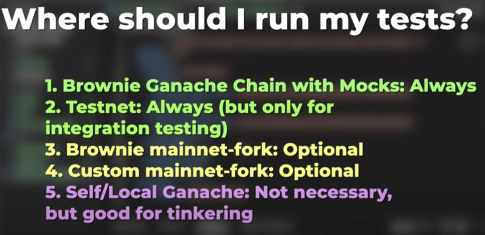

# web3

Cosas importantes:

- function <name> public/internal
- memory par strings
- **using** y **library** es similar a (extensiones en flutter)
- [**modifier**][modifier] es para cambiar el comportamiento de una función
- receive: función que se llama cuando llaman el contrato sin data
- fallback: se llama con data pero no hace match con alguna función en el contrato

// Explainer from: https://solidity-by-example.org/fallback/
// Ether is sent to contract
// is msg.data empty?
// / \
// yes no
// / \
// receive()? fallback()
// / \
// yes no
// / \
//receive() fallback()

### Brownie

Brownie sabe si debe hacer un call o una transacción
Pytest to test

`brownie init`

## accounts

##### create a custom account from metamask

- 1: Storage in brownie
- brownie accounts new <name>
- 2: load with this command
- account = accounts.load("<name>")

##### use .env

- 1: create brownie-config.yaml
- 2: dotenv: .env
- 3: import os
- 4: read account
- account = accounts.add(os.getenv("PRIVATE_KEY"))

##### use env from config

- from brownie import config
- account = accounts.add(config["wallets"]["from_key"])

## Change the network to deploy with brownie

- using .env

* `export WEB3_INFURA_PROJECT_ID=<projectid>`

- brownie run <script> --network <network>

### brownie console

Podemos usar la mayor cantidad de cosas en la consola

[//]: #
[modifier]: https://medium.com/coinmonks/solidity-tutorial-all-about-modifiers-a86cf81c14cb

### Add network to brownie

brownie networks add Ethereum ganache-local host=http://127.0.0.1:7545 chainid=1337
Crear cuenta en Alchemist to fork
brownie networks add development mainnet-fork-dev host=http://127.0.0.1 fork='https://mainnet.infura.io/v3/$WEB3_INFURA_PROJECT_D' accounts=10 mnemonic=brownie port=8545

### TEST

